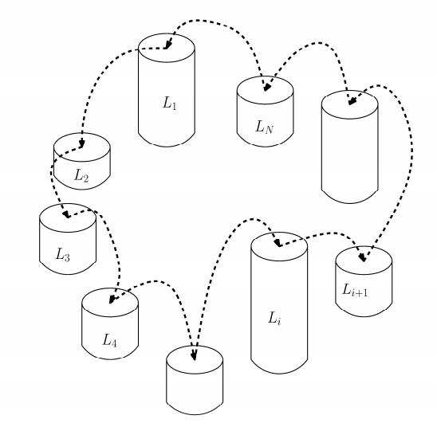

# 👻 11497. 통나무 건너뛰기

[📝 문제링크]: https://www.acmicpc.net/problem/11497

#### 💁‍♀️ 문제 설명

남규는 통나무를 세워 놓고 건너뛰기를 좋아한다. 그래서 N개의 통나무를 원형으로 세워 놓고 뛰어놀려고 한다. 남규는 원형으로 인접한 옆 통나무로 건너뛰는데, 이때 각 인접한 통나무의 높이 차가 최소가 되게 하려 한다.



통나무 건너뛰기의 난이도는 인접한 두 통나무 간의 높이의 차의 최댓값으로 결정된다. 높이가 {2, 4, 5, 7, 9}인 통나무들을 세우려 한다고 가정하자. 이를 [2, 9, 7, 4, 5]의 순서로 세웠다면, 가장 첫 통나무와 가장 마지막 통나무 역시 인접해 있다. 즉, 높이가 2인 것과 높이가 5인 것도 서로 인접해 있다. 배열 [2, 9, 7, 4, 5]의 난이도는 |2-9| = 7이다. 우리는 더 나은 배열 [2, 5, 9, 7, 4]를 만들 수 있으며 이 배열의 난이도는 |5-9| = 4이다. 이 배열보다 난이도가 낮은 배열은 만들 수 없으므로 이 배열이 남규가 찾는 답이 된다.


##### 입력

> 입력은 T개의 테스트 케이스로 이루어져 있다. 첫 줄에 T가 주어진다.
>
> 이어지는 각 줄마다 첫 줄에 통나무의 개수를 나타내는 정수 N(5 ≤ N ≤ 10,000), 둘째 줄에 각 통나무의 높이를 나타내는 정수 Li가 주어진다. (1 ≤ Li ≤ 100,000)


출력

> 각 테스트 케이스마다 한 줄에 주어진 통나무들로 만들 수 있는 최소 난이도를 출력하시오.


---------------------------


#### 🤸‍♂️ 문제 해결

```java
import java.io.BufferedReader;
import java.io.BufferedWriter;
import java.io.IOException;
import java.io.InputStreamReader;
import java.io.OutputStreamWriter;
import java.util.Arrays;
import java.util.StringTokenizer;


public class B11497 {
	public static void main(String[] args) throws IOException{
		BufferedReader br = new BufferedReader(new InputStreamReader(System.in));
		BufferedWriter bw = new BufferedWriter(new OutputStreamWriter(System.out));
        
        // 입력
		int T = Integer.parseInt(br.readLine());
		for (int i = 0; i < T; i++) {
			int N = Integer.parseInt(br.readLine());
			int [] nums = new int[N];
			StringTokenizer st = new StringTokenizer(br.readLine());
			for (int j = 0; j < N; j++) {
				nums[j] = Integer.parseInt(st.nextToken()); 
			}
			
			Arrays.sort(nums);
			int [] arr = new int[N];
            
            // 피라미드 모양이 되게 분배
			for (int j = 0; j < N; j++) {
				if (j % 2 == 0) {
					arr[j/2] = nums[j];
				} else {
					arr[N-1-j/2] = nums[j];
				}
			}
			
            // 차이가 가장 큰 것 찾기
			int mx = 0, tmp = 0;
			for (int j = 0; j < arr.length; j++) {
				if (j == N-1) {
					tmp = Math.abs(arr[j]-arr[0]);
				} else {
					tmp = Math.abs(arr[j]-arr[j+1]);
				}
				if (tmp > mx) {
					mx = tmp;
				}
			}
			bw.write(mx + "\n");
			bw.flush();
		}
		bw.close();
	}
}
```


