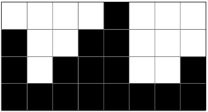
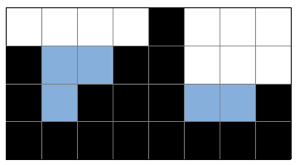

# 👻 14719. 빗물

[📝 문제링크]: https://www.acmicpc.net/problem/14719

#### 💁‍♀️ 문제 설명

2차원 세계에 블록이 쌓여있다. 비가 오면 블록 사이에 빗물이 고인다.



비는 충분히 많이 온다. 고이는 빗물의 총량은 얼마일까?


##### 입력

> 첫 번째 줄에는 2차원 세계의 세로 길이 H과 2차원 세계의 가로 길이 W가 주어진다. (1 ≤ H, W ≤ 500)
>
> 두 번째 줄에는 블록이 쌓인 높이를 의미하는 0이상 H이하의 정수가 2차원 세계의 맨 왼쪽 위치부터 차례대로 W개 주어진다.
>
> 따라서 블록 내부의 빈 공간이 생길 수 없다. 또 2차원 세계의 바닥은 항상 막혀있다고 가정하여도 좋다.


출력

> 2차원 세계에서는 한 칸의 용량은 1이다. 고이는 빗물의 총량을 출력하여라.
>
> 빗물이 전혀 고이지 않을 경우 0을 출력하여라.


---------------------------


#### 🤸‍♂️ 문제 해결

```java
import java.io.BufferedReader;
import java.io.IOException;
import java.io.InputStreamReader;
import java.util.StringTokenizer;

public class B14719 {
	public static void main(String[] args) throws IOException {
		BufferedReader br = new BufferedReader(new InputStreamReader(System.in));
		StringTokenizer st = new StringTokenizer(br.readLine());
		int H = Integer.parseInt(st.nextToken());
		int W = Integer.parseInt(st.nextToken());
		
		int [] arr = new int [W];
		st = new StringTokenizer(br.readLine());
		for (int i = 0; i < W; i++) {
			arr[i] = Integer.parseInt(st.nextToken());
		}
		
		int l = 0; int r = W-1; 
		int ml = 0; int mr = W-1; // 기준 기둥
		int ans = 0;
		while (l < r) {
			if (arr[l] <= arr[r]) {
				l ++;
                // 기준 기둥보다 작으면 물 고임
				if (arr[ml] > arr[l]) ans += arr[ml] - arr[l]; 
                // 기준 기중 바꾸기
				else ml = l;
			} else {
				r --;
				if (arr[mr] > arr[r]) ans += arr[mr] - arr[r];
				else mr = r;
			}
		}
		System.out.println(ans);	
	}
}
```


