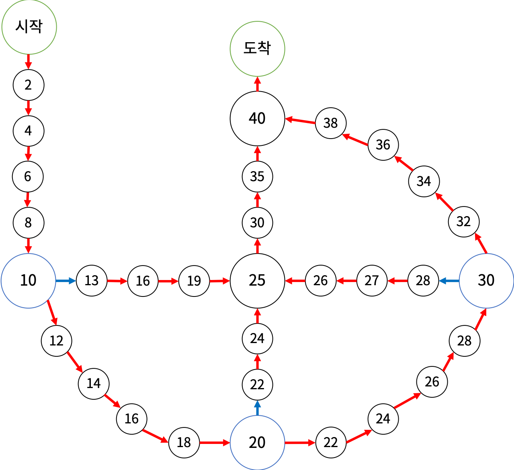

# 👻 17825. 주사위 윷놀이

[📝 문제링크]: https://www.acmicpc.net/problem/17825


#### 💁‍♀️ 문제 설명

주사위 윷놀이는 다음과 같은 게임판에서 하는 게임이다.



- 처음에는 시작 칸에 말 4개가 있다.
- 말은 게임판에 그려진 화살표의 방향대로만 이동할 수 있다. 말이 파란색 칸에서 이동을 시작하면 파란색 화살표를 타야 하고, 이동하는 도중이거나 파란색이 아닌 칸에서 이동을 시작하면 빨간색 화살표를 타야 한다. 말이 도착 칸으로 이동하면 주사위에 나온 수와 관계 없이 이동을 마친다.
- 게임은 10개의 턴으로 이루어진다. 매 턴마다 1부터 5까지 한 면에 하나씩 적혀있는 5면체 주사위를 굴리고, 도착 칸에 있지 않은 말을 하나 골라 주사위에 나온 수만큼 이동시킨다.
- 말이 이동을 마치는 칸에 다른 말이 있으면 그 말은 고를 수 없다. 단, 이동을 마치는 칸이 도착 칸이면 고를 수 있다.
- 말이 이동을 마칠 때마다 칸에 적혀있는 수가 점수에 추가된다.

주사위에서 나올 수 10개를 미리 알고 있을 때, 얻을 수 있는 점수의 최댓값을 구해보자.


##### 입력

> 첫째 줄에 주사위에서 나올 수 10개가 순서대로 주어진다.


##### 출력

> 얻을 수 있는 점수의 최댓값을 출력한다.


---------------------------


#### 🤸‍♂️ 문제 해결

```python
import sys
input = sys.stdin.readline
dice = list(map(int,input().split()))

horse = [[0]*2 for _ in range(4)] # 말 정보:  [f, x] ⇒ [모서리 및 중앙지점, 위치]
goal = [0]*4 # 도착 여부

mx = 0

def dfs(n, S):
    global mx
    if n == 10:
        if mx < S:
            mx = S
        return

    for i in range(4):
        if not goal[i]: # 도착하지 않은 말
            f, x = horse[i][0], horse[i][1]
            nf, nx = f, x
            
            if horse[i][0] == 10: # 10 →
                nx = x + 3*dice[n]
                if nx > 19: # 10 → 25 →
                    nx = (nx - 19) // 3 * 5 + 20
                    nf = 25

            elif horse[i][0] == 20: # 20 → 
                nx = x + 2*dice[n]
                if nx > 24: # 20 → 25 →
                    nx = ((nx - 24) // 2 - 1) * 5 + 25
                    nf = 25

            elif horse[i][0] == 30: # 30 → 
                if nx == 30:
                    nx -= 1
                nx = nx + (-1)*dice[n]
                
                if nx < 26: # 30 → 25 →
                    nx = (25 - nx) * 5 + 25
                    nf = 25

            elif horse[i][0] == 25: # → 25 →
                nx = x + 5*dice[n]

            elif horse[i][0] == 0: # 어떤 모서리도 거치지 않았을 경우
                nx = x + 2*dice[n]
                
                if not nx % 10: # 모서리 혹은 40 
                    if nx < 40: # 모서리
                        nf = nx
                    else: # 40
                        nf = 25 # 아래 과정을 위해

            if [nf, nx] in horse: # 이동하려는 칸에 말이 있으면
                continue

            if nx > 40: # 도착
                nx = 0 
                goal[i] = 1 

            horse[i][0], horse[i][1] = nf, nx
            dfs(n + 1, S + nx)
            horse[i][0], horse[i][1] = f, x
            goal[i] = 0


dfs(0, 0)
print(mx)
```


##### *오류*

- `말이 이동을 마치는 칸에 다른 말이 있으면 그 말은 고를 수 없다. ` ⇒ 조건 설정 빈약
  - 22, 24, 26, 28, 30은 두 군데라 어느 구간인지 확인 해줘야 함
  - 40의 경우, 다른 루트로 왔어도 한 곳이기 때문에 말 정보 동일시 해줘야 함

