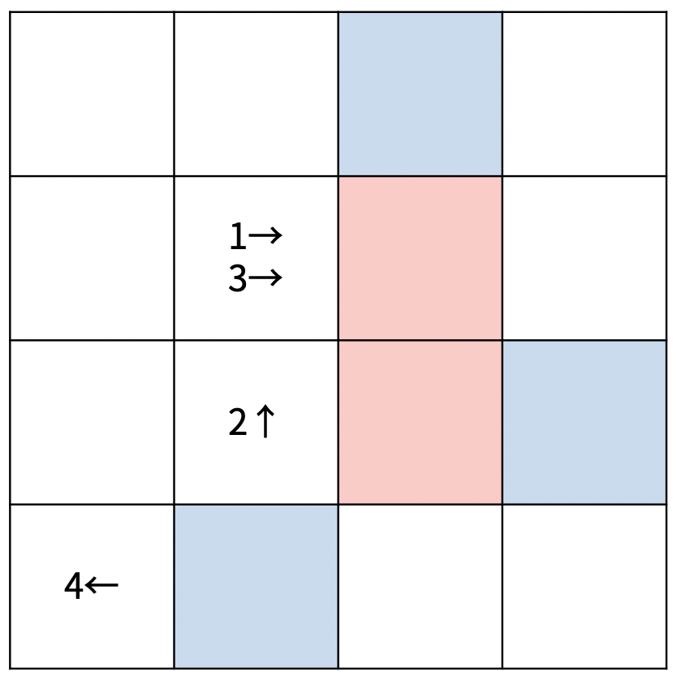
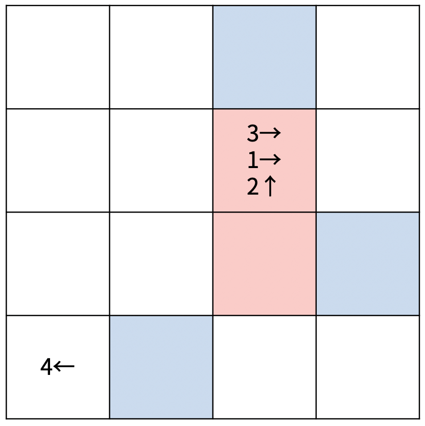
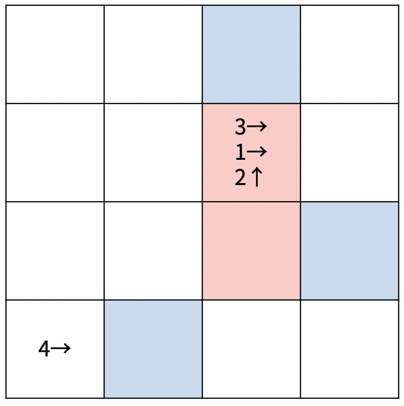
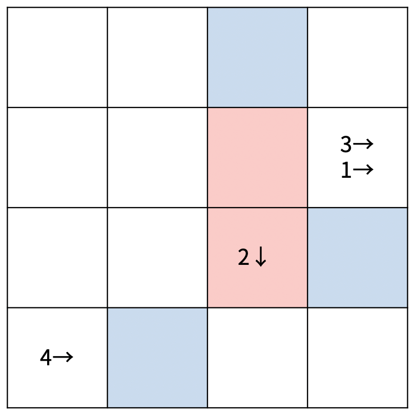
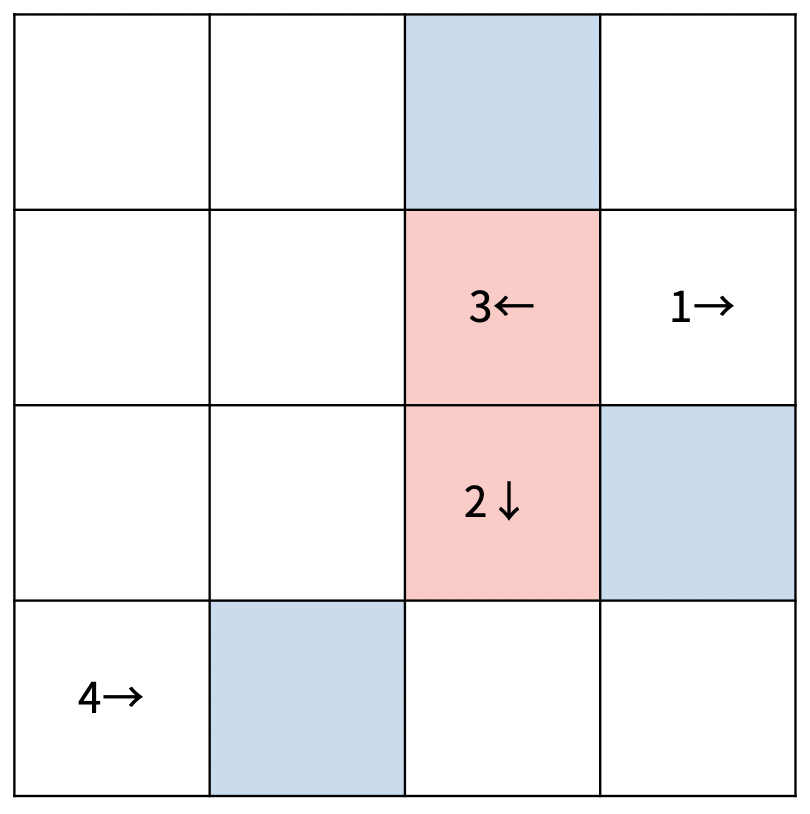

# 👻 17837. 새로운 게임 2 

[📝 문제링크]: https://www.acmicpc.net/problem/17837


#### 💁‍♀️ 문제 설명

재현이는 주변을 살펴보던 중 체스판과 말을 이용해서 새로운 게임을 만들기로 했다. 새로운 게임은 크기가 N×N인 체스판에서 진행되고, 사용하는 말의 개수는 K개이다. 말은 원판모양이고, 하나의 말 위에 다른 말을 올릴 수 있다. 체스판의 각 칸은 흰색, 빨간색, 파란색 중 하나로 색칠되어있다.

게임은 체스판 위에 말 K개를 놓고 시작한다. 말은 1번부터 K번까지 번호가 매겨져 있고, 이동 방향도 미리 정해져 있다. 이동 방향은 위, 아래, 왼쪽, 오른쪽 4가지 중 하나이다.

턴 한 번은 1번 말부터 K번 말까지 순서대로 이동시키는 것이다. 한 말이 이동할 때 위에 올려져 있는 말도 함께 이동한다. 말의 이동 방향에 있는 칸에 따라서 말의 이동이 다르며 아래와 같다. 턴이 진행되던 중에 말이 4개 이상 쌓이는 순간 게임이 종료된다.

- A번 말이 이동하려는 칸이
  - 흰색인 경우에는 그 칸으로 이동한다. 이동하려는 칸에 말이 이미 있는 경우에는 가장 위에 A번 말을 올려놓는다.
    - A번 말의 위에 다른 말이 있는 경우에는 A번 말과 위에 있는 모든 말이 이동한다.
    - 예를 들어, A, B, C로 쌓여있고, 이동하려는 칸에 D, E가 있는 경우에는 A번 말이 이동한 후에는 D, E, A, B, C가 된다.
  - 빨간색인 경우에는 이동한 후에 A번 말과 그 위에 있는 모든 말의 쌓여있는 순서를 반대로 바꾼다.
    - A, B, C가 이동하고, 이동하려는 칸에 말이 없는 경우에는 C, B, A가 된다.
    - A, D, F, G가 이동하고, 이동하려는 칸에 말이 E, C, B로 있는 경우에는 E, C, B, G, F, D, A가 된다.
  - 파란색인 경우에는 A번 말의 이동 방향을 반대로 하고 한 칸 이동한다. 방향을 반대로 바꾼 후에 이동하려는 칸이 파란색인 경우에는 이동하지 않고 가만히 있는다.
  - 체스판을 벗어나는 경우에는 파란색과 같은 경우이다.

다음은 크기가 4×4인 체스판 위에 말이 4개 있는 경우이다.


첫 번째 턴은 다음과 같이 진행된다.

|  |  |  |  |
| ------------------------------------------ | ------------------------------------------ | ------------------------------------------ | ------------------------------------------ |
|                                            |                                            |                                            |                                            |

두 번째 턴은 다음과 같이 진행된다.

|  |  |  |  |
| ------------------------------------------ | ------------------------------------------ | ------------------------------------------ | ------------------------------------------ |
|                                            |                                            |                                            |                                            |

체스판의 크기와 말의 위치, 이동 방향이 모두 주어졌을 때, 게임이 종료되는 턴의 번호를 구해보자.


##### 입력

> 첫째 줄에 체스판의 크기 N, 말의 개수 K가 주어진다. 둘째 줄부터 N개의 줄에 체스판의 정보가 주어진다. 체스판의 정보는 정수로 이루어져 있고, 각 정수는 칸의 색을 의미한다. 0은 흰색, 1은 빨간색, 2는 파란색이다.
>
> 다음 K개의 줄에 말의 정보가 1번 말부터 순서대로 주어진다. 말의 정보는 세 개의 정수로 이루어져 있고, 순서대로 행, 열의 번호, 이동 방향이다. 행과 열의 번호는 1부터 시작하고, 이동 방향은 4보다 작거나 같은 자연수이고 1부터 순서대로 →, ←, ↑, ↓의 의미를 갖는다.
>
> 같은 칸에 말이 두 개 이상 있는 경우는 입력으로 주어지지 않는다.


출력

> 게임이 종료되는 턴의 번호를 출력한다. 그 값이 1,000보다 크거나 절대로 게임이 종료되지 않는 경우에는 -1을 출력한다.

---------------------------


#### 🤸‍♂️ 문제 해결

```python
import sys
input = sys.stdin.readline

dx = [1, 0, 0, -1]
dy = [0, 1, -1, 0]

N, K = map(int,input().split())
board = [list(map(int,input().split())) for _ in range(N)]

chess = list([[] for _ in range(N)] for _ in range(N)) # 보드 위 말 표시
info = [] # 1~k번말 위치,방향

for i in range(K):
    x, y, d = map(int,input().split())
    chess[x-1][y-1].append(i) 
    info.append([x-1,y-1,d%4])

cnt, result = 0, -1
while cnt <= 1000 and result < 0: 
    cnt += 1
    for i in range(K): # 순서대로 이동
        x, y, d = info[i][0], info[i][1], info[i][2]
        nx, ny = x + dx[d], y + dy[d] 

        if nx < 0 or nx >= N or ny < 0 or ny >= N or board[nx][ny] == 2: # 파란색일 경우
            if d == 0 or d == 2: # 방향 전환
                d = (d-1) % 4
            else:
                d = (d+1) % 4
            info[i][2] = d
            nx, ny = x + dx[d], y + dy[d]

        if 0 <= nx < N and 0 <= ny < N and board[nx][ny] < 2: # 흰색 or 빨간색일 경우
            idx = chess[x][y].index(i)
            tmp = chess[x][y][idx:] # 이동시킬 말들
            if board[nx][ny]: # 빨간색이면 순서 반대로
                tmp.reverse()
            chess[nx][ny] += tmp
            chess[x][y] = chess[x][y][:idx]
            if len(chess[nx][ny]) >= 4: # 4개 이상 모였으면
                result = cnt
                break
            for j in tmp: # info 위치 갱신
                info[j][0], info[j][1] = nx, ny

print(result)
```


##### *오류*

- 4개 <u>**이상**</u>


